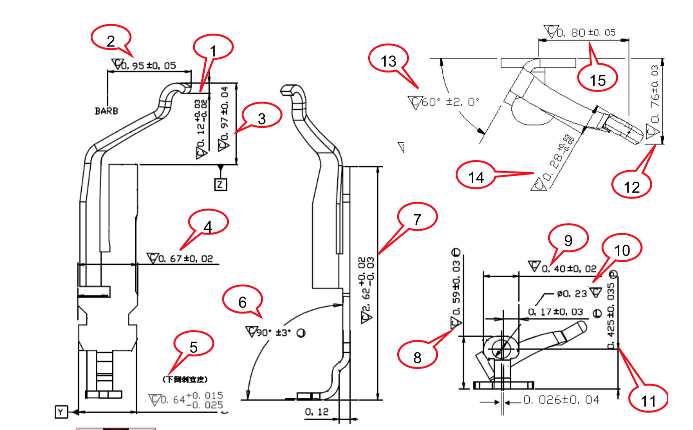
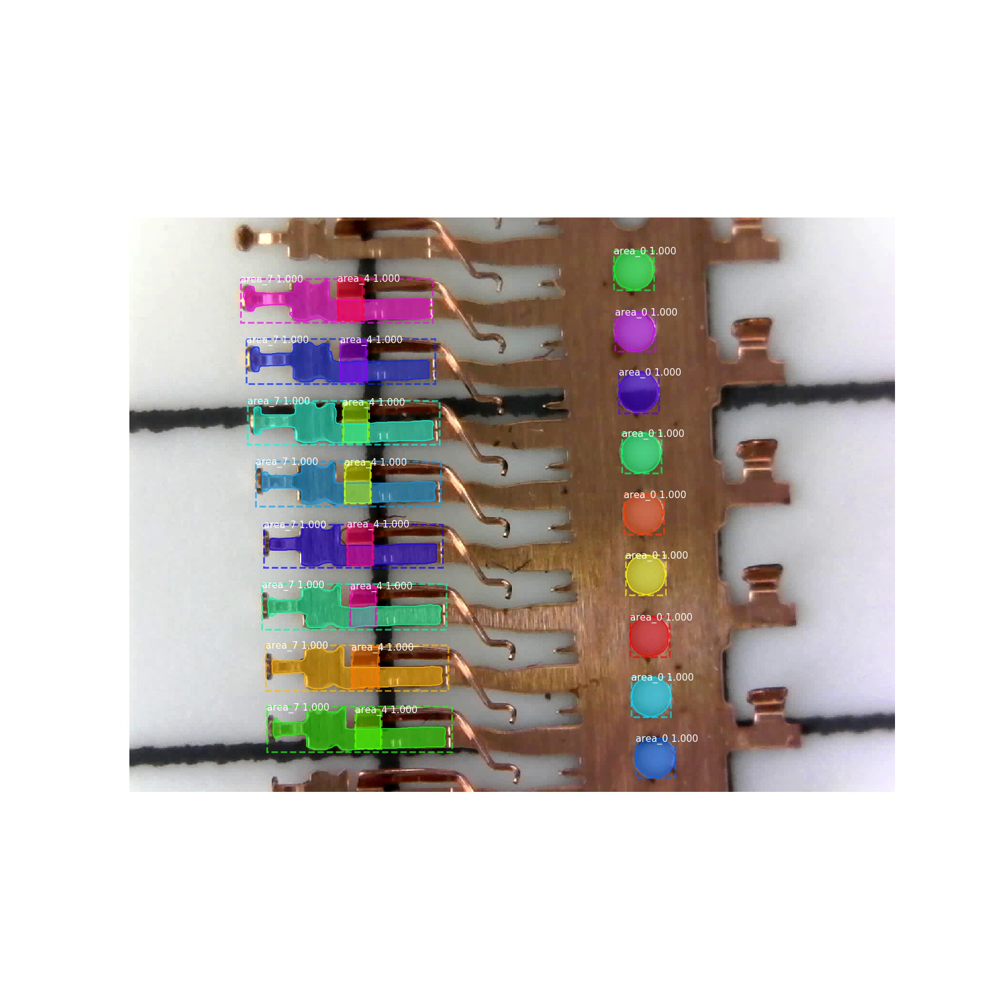
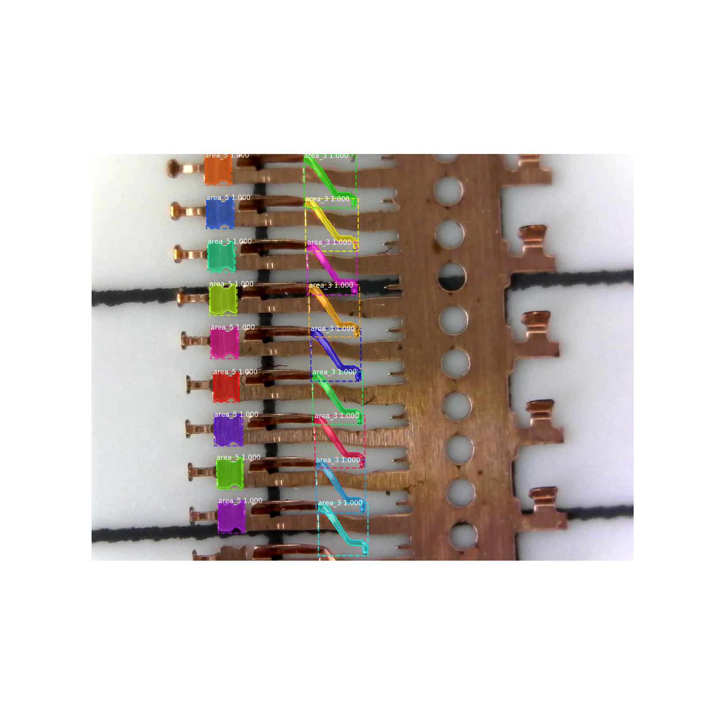

### foxconn_aoi 富士康金手指连接件尺寸自动测量
- 目标：通过程序自动识别并测量以下图纸中 1 ~ 15 处位置的尺寸，然后把实际测量得到的尺寸与图纸中的标准尺寸进行对比。

  

- 实物：俯视图

  
  
- 通过计算机视觉 OpenCV 或者 Deep Learning 图片识别先定位到某个位置，然后获取这个位置占有的像素面积，根据比例尺，计算得到尺寸。

- 过程记录：
    1. 使用 OpenCV 中的多种匹配算法也很难定位到具体的某个位置，因为这些 1~15 号位置是人为定义分割的，整个物体是一个整体。
    2. 使用 Deep Learning 图片识别，尝试多种模型也会遇到很多问题，其中之一便是实物尺寸太小，通过CNN处理后提取的特征图会更小，识别会受影响，使用工业相机发现放大倍数有限，厂家也没有定制的更大倍数镜头。
    3. 部分位置的需要测量角度，也很难处理。

- 部分成果：
    1. 0/4/7号位置识别测量结果：
    
    2. 3/5号位置识别测量结果：
